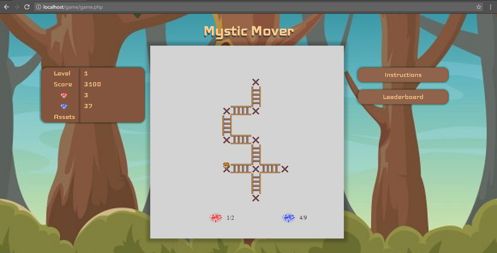
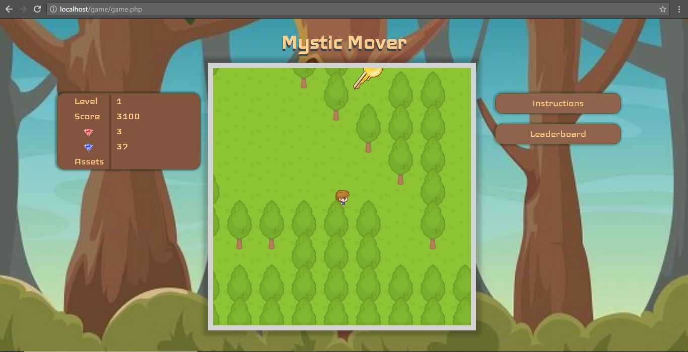
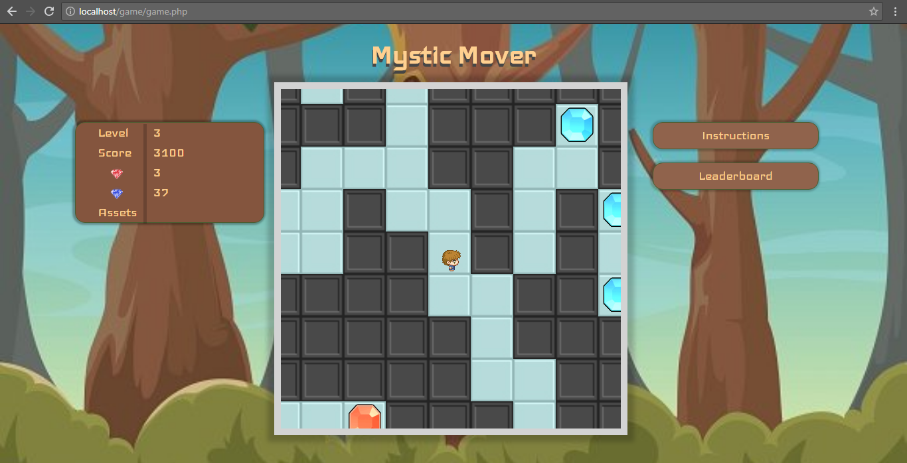
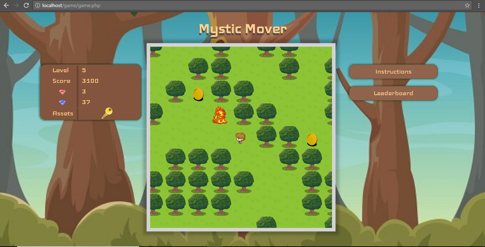
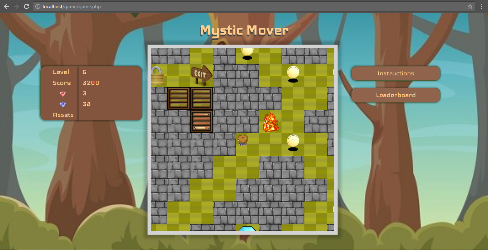
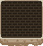
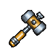
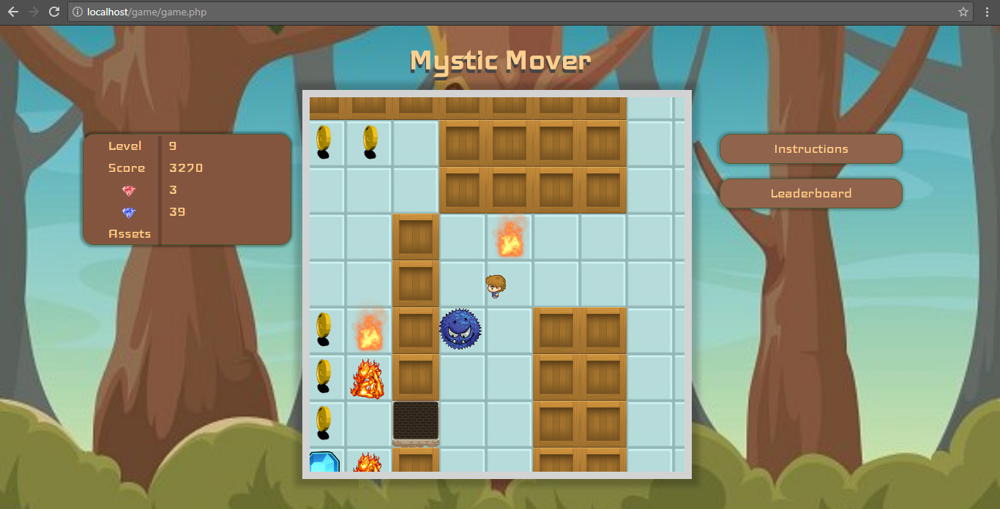

# Mystic_Mover

This game is written in javascript and php.

There are 12 levels in the game. The left side display your current score and diamonds and your current assets.
In the main map you can find all the 12 levels. To play any level, just go to that level and press enter.

Player can be moved using arrow keys or 'w','a','s',d' and to use any asset space can be pressed.

The goal of game is to get the maximum score.
Score can be increased by collecting diamonds and coins.
There are two types of diamonds in game. Red diamonds are very rare and gives you 1000 points, Blue diamonds gives you 50 points and coins gives you 10 points.
To proceed to next level or go to the map you have to find the exit.

There are various types of enemies and obstacles in the game.
Making contact with any of them will cost you some points.

There is minimum red dimaonds requirement for each level.

While playing the game, you may encounter locks , gates or breakable walls.

Breakable wall: 
To open the lock/gate you need to find the key. At a time you can have maximum of 1 key. To open a lock just stand in front of the lock and press space.

To break some special breakable walls  , you need the hammer , which is hidden in a particular level.
When you find the hammer, you can go to the previous levels also, break those walls and find new paths which were inaccessible before.

